# Redis-x

## 作者

丁伟强、常东亮、张慧豪、张书涵

https://github.com/970263611/redis-x

## 基础概念

### 名词解释

##### <标题>

标识引用其他位置的标题包含内容

##### 持久化

Redis 提供了一系列持久性选项，这些包括：

- RDB（Redis数据库）
- AOF（仅追加文件）
- 无持久性：完全禁用持久性
- RDB + AOF：同一实例中组合 AOF 和 RDB

Redis默认开启RDB，关闭AOF。

##### RDB

以指定的时间间隔执行数据集的时间点快照。

##### AOF

记录服务器接收的每个写入操作，使用与 Redis 协议本身相同的格式记录命令。

##### 对象类型

Redis是一种基于内存的键值对存储系统，它支持多种类型的数据结构，这些数据结构在Redis中被封为对象。Redis中的对象类型主要包括：

- 字符串对象（String）：最基本的对象类型，用于存储文本数据。
- 列表对象（List）：有序的元素集合，元素按照插入顺序排列。
- 哈希对象（Hash）：键值对集合，其中键和值都是字符串。
- 集合对象（Set）：无序的元素集合，元素不重复。
- 有序集合对象（ZSet）：元素按照某种排序规则（如分数）有序排列的集合。
- Stream：5.0 版本引入的一种新的数据类型，它是一个持久化的、可查询的、可扩展的消息队列服务。
- 模块对象（Module）：4.0 版本引入的一个新特性，它允许开发者扩展 Redis 的功能。 通过创建模块，开发者可以定义新的命令，数据类型，甚至改变 Redis 的行为。

##### 存储类型

指Redis存储数据时的内部表示形式。Redis中的每个对象都有一个`type`属性，它记录了对象的类型，如字符串、列表、哈希、集合或有序集合等。同时，还有一个`encoding`属性，它记录了对象所使用的编码，即对象的底层数据结构实现。每种类型的对象都至少使用了两种不同的编码，以便在不同的情况下优化性能和空间效率。

| 存储类型                        | 十进制 | 十六进制 |
| ------------------------------- | ------ | -------- |
| RDB\_TYPE\_STRING               | 0      | 00       |
| RDB\_TYPE\_LIST                 | 1      | 01       |
| RDB\_TYPE\_SET                  | 2      | 02       |
| RDB\_TYPE\_ZSET                 | 3      | 03       |
| RDB\_TYPE\_HASH                 | 4      | 04       |
| RDB\_TYPE\_ZSET\_2              | 5      | 05       |
| RDB\_TYPE\_MODULE               | 6      | 06       |
| RDB\_TYPE\_MODULE\_2            | 7      | 07       |
| RDB\_TYPE\_HASH\_ZIPMAP         | 9      | 09       |
| RDB\_TYPE\_LIST\_ZIPLIST        | 10     | 0a       |
| RDB\_TYPE\_SET\_INTSET          | 11     | 0b       |
| RDB\_TYPE\_ZSET\_ZIPLIST        | 12     | 0c       |
| RDB\_TYPE\_HASH\_ZIPLIST        | 13     | 0d       |
| RDB\_TYPE\_LIST\_QUICKLIST      | 14     | 0e       |
| RDB\_TYPE\_STREAM\_LISTPACKS    | 15     | 0f       |
| RDB\_TYPE\_HASH\_LISTPACK       | 16     | 10       |
| RDB\_TYPE\_ZSET\_LISTPACK       | 17     | 11       |
| RDB\_TYPE\_LIST\_QUICKLIST\_2   | 18     | 12       |
| RDB\_TYPE\_STREAM\_LISTPACKS\_2 | 19     | 13       |
| RDB\_TYPE\_SET\_LISTPACK        | 20     | 14       |
| RDB\_TYPE\_STREAM\_LISTPACKS\_3 | 21     | 15       |

##### 对象类型和存储类型对应关系

| 对象类型 | 对象编码类型                                     | rdb类型                         | 十进制 | 十六进制 | rdb版本          |           |
| -------- | ------------------------------------------------ | ------------------------------- | ------ | -------- | ---------------- | --------- |
| STRING   |                                                  | RDB\_TYPE\_STRING               | 0      | 00       |                  |           |
| LIST     |                                                  | RDB\_TYPE\_LIST                 | 1      | 01       |                  |           |
|          |                                                  | RDB\_TYPE\_LIST\_ZIPLIST        | 10     | 0a       |                  |           |
|          | OBJ\_ENCODING\_QUICKLIST                         | RDB\_TYPE\_LIST\_QUICKLIST      | 14     | 0e       | rdb version 7\*  |           |
|          | OBJ\_ENCODING\_QUICKLIST/OBJ\_ENCODING\_LISTPACK | RDB\_TYPE\_LIST\_QUICKLIST\_2   | 18     | 12       | rdb version 10\* |           |
| SET      | OBJ\_ENCODING\_HT                                | RDB\_TYPE\_SET                  | 2      | 02       |                  |           |
|          | OBJ\_ENCODING\_INTSET                            | RDB\_TYPE\_SET\_INTSET          | 11     | 0b       |                  |           |
|          | OBJ\_ENCODING\_LISTPACK                          | RDB\_TYPE\_SET\_LISTPACK        | 20     | 14       |                  | redis 7.2 |
| ZSET     |                                                  | RDB\_TYPE\_ZSET                 | 3      | 03       |                  |           |
|          | OBJ\_ENCODING\_SKIPLIST                          | RDB\_TYPE\_ZSET\_2              | 5      | 05       | rdb version 8\*  |           |
|          | OBJ\_ENCODING\_ZIPLIST                           | RDB\_TYPE\_ZSET\_ZIPLIST        | 12     | 0c       |                  |           |
|          | OBJ\_ENCODING\_LISTPACK                          | RDB\_TYPE\_ZSET\_LISTPACK       | 17     | 11       | rdb version 10\* |           |
| HASH     | OBJ\_ENCODING\_HT                                | RDB\_TYPE\_HASH                 | 4      | 04       |                  |           |
|          |                                                  | RDB\_TYPE\_HASH\_ZIPMAP         | 9      | 09       |                  |           |
|          | OBJ\_ENCODING\_ZIPLIST                           | RDB\_TYPE\_HASH\_ZIPLIST        | 13     | 0d       |                  |           |
|          | OBJ\_ENCODING\_LISTPACK                          | RDB\_TYPE\_HASH\_LISTPACK       | 16     | 10       | rdb version 10\* |           |
| STREAM   |                                                  | RDB\_TYPE\_STREAM\_LISTPACKS    | 15     | 0f       | rdb version 9\*  |           |
|          |                                                  | RDB\_TYPE\_STREAM\_LISTPACKS\_2 | 19     | 13       | rdb version 10\* |           |
|          |                                                  | RDB\_TYPE\_STREAM\_LISTPACKS\_3 | 21     | 15       |                  | redis 7.2 |
| MODULE   |                                                  | RDB\_TYPE\_MODULE               | 6      | 06       | rdb version 8\*  |           |
|          |                                                  | RDB\_TYPE\_MODULE\_2            | 7      | 07       | version 8\*      |           |

##### 大小端模式

大端模式（Big-Endian），是指数据的高字节保存在内存的低地址中，而数据的低字节保存在内存的高地址中，存储模式类似把数据当作字符串顺序处理。

小端模式（Little-Endian），是指数据的高字节保存在内存的高地址中，而数据的低字节保存在内存的低地址中，存储模式将地址的高低和数据位权有效地结合起来。

### Redis交互协议

##### 简介

RESP (Redis Serialization Protocol)，它是一种简单的文本协议，用于在**客户端和服务器之间**操作和传输数据。

##### 协议说明

```text
1.单行字符串：首字节是 ‘+’ ，后面跟上单行字符串，不能包含CR或LF字符的字符串（不允许换行），以CRLF（ "\r\n" ）结尾。

例如返回"OK"： "+OK\r\n"

2.错误（Errors）：首字节是 ‘-’ ，与单行字符串格式一样，只是字符串是异常信息。

例如："-Error message\r\n"

3.数值：首字节是 ‘:’ ，后面跟上数字格式的字符串，以CRLF结尾。

例如：":10\r\n"

4.多行字符串：首字节是 ‘$’ ，表示二进制安全的字符串，最大支持512MB。

例如："$5\r\nhello\r\n"

如果大小为0，则代表空字符串："$0\r\n\r\n"

如果大小为-1，则代表不存在："$-1\r\n"

5.数组：首字节是 ‘*’，后面跟上数组元素个数，再跟上元素，元素数据类型不限，也可以嵌套。

例如：

*3\r\n

$3\r\nset\r\n

$7\r\nredis-x\r\n

$11\r\nhello-world\r\n

6.在线指令：inline类型为redis支持简化指令的交互，不特别介绍
```

### Redis持久化

#### AOF文件

##### 配置AOF持久化

AOF默认是关闭的，需要修改redis.conf配置文件来开启AOF。

```text
# 是否开启AOF功能，默认是no
appendonly yes
# AOF文件的名称
appendfilename "appendonly.aof"
```

AOF的命令记录的频率可以通过redis.conf文件来配

```text
# 表示每执行一次写命令，立即记录到AOF文件
appendfsync always 
# 写命令执行完先放入AOF缓冲区，然后表示每隔1秒将缓冲区数据写到AOF文件，是默认方案
appendfsync everysec 
# 写命令执行完先放入AOF缓冲区，由操作系统决定何时将缓冲区内容写回磁盘
appendfsync no
```

##### AOF文件数据格式

```text
*3\r\n
$3\r\nset\r\n
$7\r\nredis-x\r\n
$11\r\nhello-world\r\n
```

##### AOF数据重写

**触发日志重写**:

```text
auto-aof-rewrite-percentage 100 (AOF文件比上次文件 增长超过多少百分比则触发重写)
auto-aof-rewrite-min-size 50kb (AOF文件体积最小多大以上才触发重写)
```

**自动触发aof重写规则如下:**

```text
1.1 初始化0kb,当达到50kb的时候,增长百分比肯定超过100%，触发重写
1.2 重写后假设25kb,继续写入aof(此时写入aof的命令还是纯文本格式),当达到50kb,(50-25)/25 也达到了100增长百分比触发重写。
1.3 重写后假设变成 37.5kb继续写入aof(写入aof的命令还是纯文本格式),当达到50kb,**并不会触发重写,因为增长百分比并没有超过100，得等到文件大小达到75kb才触发重写**
2 直接使用bgrewriteaof命令
```

1. 必须同时满足两个条件才可以触发自动重写。

2. 增长百分比是当前aof文件大小与上一次重写后的aof文件大小做比较。

3. 在当前重写后和下一次重写前的间隔，写入aof文件的数据还是纯文本格式。

4. 重写后的数据格式与RDB数据格式一样。

**注**：根据Redis官网说法,AOF存在被截断和损坏的场景。

官方不鼓励单独使用 AOF，因为要有一个不时的 RDB 快照是进行数据库备份的好主意， 在 AOF 引擎出现错误的情况下可以更快地重新启动。如果非常关心你的数据，但仍然可以忍受几分钟的发生灾难时数据丢失，可以简单地单独使用 RDB。

```
1. 如果我的AOF被截断了，我该怎么办？
    服务器可能在写入AOF文件时崩溃，或者在撰写本文时，存储AOF文件的卷已满。发生这种情况时，AOF仍然包含表示给定时间点版本的一致数据数据集（使用默认 AOF fsync 时，可能最长为一秒 policy），但AOF中的最后一个命令可能会被截断。无论如何，Redis 的最新主要版本将能够加载AOF丢弃文件中最后一个格式不正确的命令。在本例中，服务器将发出如下日志：
    * Reading RDB preamble from AOF file...
    * Reading the remaining AOF tail...
    # !!! Warning: short read while loading the AOF file !!!
    # !!! Truncating the AOF at offset 439 !!!
    # AOF loaded anyway because aof-load-truncated is enabled
    您可以更改默认配置以强制Redis停止在情况，但默认配置是继续，而不管事实上，文件中的最后一个命令格式不正确，以保证重新启动后的可用性。
    旧版本的Redis可能无法恢复可能需要执行以下步骤：
    制作 AOF 文件的备份副本。
    使用 Redis 附带的工具修复原始文件：redis-check-aof
    $ redis-check-aof --fix <filename>
    （可选）用于检查两个文件之间的区别。diff -u
    使用固定文件重新启动服务器。
2. 如果我的AOF损坏了，我该怎么办？
    如果AOF文件不仅被截断，而且被无效字节损坏序列在中间，事情就更复杂了。Redis会抱怨在启动时，将中止：
    * Reading the remaining AOF tail...
    # Bad file format reading the append only file: make a backup of your AOF file, then use ./redis-check-aof --fix <filename>
    最好的办法是运行该实用程序，最初没有选项，然后了解问题，跳转到给定的 偏移量，并查看是否可以手动修复文件：AOF使用与Redis协议相同的格式，并且非常容易手动地修复。否则，可以让实用程序为我们修复文件，但是在这种情况下，从无效部分到末尾的所有AOF部分文件可能会被丢弃，如果 损坏恰好位于文件的初始部分。redis-check-aof--fix
```

#### RDB文件

##### 主动rdb持久化

1. 主动在redis-cli执行save/bgsave命令，触发RDB

   save：主线程将内存数据持久化到rdb文件，同步。

   bgsave：共享主线程内存数据的子线程将内存数据持久化，当子进程写入完新的 RDB 文件时，替换旧的 RDB 文件，异步。

2. 在redis.conf的默认配置,会在存储过程中达到一定的条件触发RDB

```text
save [seconds] [changes]
save 60 10  #60秒内，如果至少有10个key被修改，则执行bgsave，如果是save "" 则表示禁用RDB
```

##### RDB文件数据格式

```纯文本
RDB        =    'REDIS', $version, [AUX], [MODULE_AUX], [FUNCTION], {DBSELECT, [DBRESIZE], {RECORD}}, '0xFF', [$checksum];
RECORD     =    [EXPIRED], [IDLE | FREQ], KEY, VALUE;
DBSELECT   =    '0xFE', $length;
AUX        =    '0xFA', $string, $string;              (*Introduced in rdb version 7*)
MODULE_AUX =    '0xF7', $module2;                      (*Introduced in rdb version 9*)
FUNCTION   =    '0xF6', $function;                     (*Introduced in rdb version 10*)
DBRESIZE   =    '0xFB', $length, $length;              (*Introduced in rdb version 7*)
EXPIRED    =    ('0xFD', $second) | ('0xFC', $millisecond);
IDLE       =    '0xF8', $value-type;                   (*Introduced in rdb version 9*)
FREQ       =    '0xF9', $length;                       (*Introduced in rdb version 9*)
KEY        =    $string;
VALUE      =    $value-type, ( $string
                             | $list
                             | $set
                             | $zset
                             | $hash
                             | $zset2                  (*Introduced in rdb version 8*)
                             | $module                 (*Introduced in rdb version 8*)
                             | $module2                (*Introduced in rdb version 8*)
                             | $hashzipmap
                             | $listziplist
                             | $setintset
                             | $zsetziplist
                             | $hashziplist
                             | $listquicklist          (*Introduced in rdb version 7*)
                             | $streamlistpacks);      (*Introduced in rdb version 9*)
                             | $zsetlistpack);         (*Introduced in rdb version 10*)
                             | $hashlistpack);         (*Introduced in rdb version 10*)
                             | $listquicklist2);       (*Introduced in rdb version 10*)
                             | $streamlistpacks2);     (*Introduced in rdb version 10*)
```

##### RDB文件描述信息

| **字段名**  | **属性名** | **编码规则**               | **描述**                  |
| ----------- | ---------- | -------------------------- | ------------------------- |
| REDIS       |            |                            | 字符串“REDIS”             |
| VERSION     |            |                            | RDB 版本号                |
| AUX         |            | 0xFA开始                   | 属性信息                  |
|             | redis-ver  | key,value                  | redis版本                 |
|             | redis-bits | key,value                  | bit架构                   |
|             | ctime      | key,value                  | rdb文件创建时间           |
|             | used-mem   | key,value                  | rdb文件使用大小           |
|             | aof-base   | key,value                  | 是否是aof基准文件         |
| MODULE\_AUX |            | 0xF7开始                   | 模块属性字段  是可选参数  |
| FUNCTION    |            | 0xF6开始                   | 函数 是可选参数           |
|             |            | 0xF5开始                   | 函数 测试版本，正式版本无 |
| DBSELECT    |            | 0xFE开始                   | 数据库选择器              |
| DBRESIZE    |            | 0xFB开始                   | 数据库大小                |
| RECORD      |            | 详见“数据内容信息提取”章节 | 数据部分                  |
|             | EXPIRED    |                            | 过期时间                  |
|             | IDLE       |                            | 值类型                    |
|             | KEY        | string编码                 | 键信息                    |
|             | VALUE      | string编码                 | 值信息                    |
| EOF         |            | 0xFF开始                   | 结束标志                  |
| CHECKSUM    |            |                            | CRC64校验码               |

###### RDB起始逻辑字符串

起始5个字节为"REDIS"

```
52 45 44 49 53  # "REDIS"
```

###### RDB 版本号

接下来的 4 个字节存储 rdb 格式的版本号。这 4 个字节被解释为 ascii 字符，然后使用字符串到整数的转换转换为整数。

```
30 30 31 31 # Version = 11
```

###### **AUX 属性字段**部分

```
0xFA开始,0xFA代表这部分数据是 AUX属性字段,不同redis版本的属性字段可能不一样
```

redis-ver

```
这部分对应FA 09 72 65 64 69 73 2D 76 65 72 05 37 2E 32 2E 34
其中开头的FA(250)代表这部分数据是 AUX 属性字段
然后是09 72 65 64 69 73 2D 76 65 72，09 代表随后的 9个字节是属性名，即redis-ver
最后是05 36 2E 30  2E 36，其中 05 代表随后的 5 个字节是属性名对应的字段值，即 Redis 的版本号7.2.4。
```

redis-bits

```
这部分对应FA 0A 72 65 64 69 73 2D 62 69 74 73 C0 40。 
字节是属性名，即redis-bits。
但是随后的C0就不再是代表值的长度了，这里先说明C0代表后续的一个字节按照整数进行读取，对应0x40（64），
即代表是 Redis 的 64位架构。
```

ctime

```
这部分对应FA 08 75 73 65 64 2D 6D 65 6D C2 F8 2C 11 00。
08代表随后的 8 字节是属性名，即used-mem。
C2代表后续的 4 字节即创建 rdb 文件前占用的内存是 1125624 字节（1.12 MB）。
```

used-mem

```
这部分对应FA 08 75 73 65 64 2D 6D 65 6D C2 F8 2C 11 00。
08代表随后的 8 字节是属性名，即used-mem。
C2代表后续的 4 字节即创建 rdb 文件前占用的内存是 1125624 字节（1.12 MB）。
```

aof-base

```
这部分对应FA 08 61 6F 66 2D 62 61 73 65 C0 00，
08代表随后的 8 字节是属性名，即aof-base。
随后的C0代表后续的 1 字节即00表示整数，即该 RDB 文件不是作为 AOF 的基准文件
```

###### MODULE\_AUX部分

```
0xF7开始,是Redis 4.0版本中引入的一个新特性
```

###### **FUNCTION**

```
0xF6开始,是Redis 7.0版本中引入的一个新特性
```

###### DATA部分（以下部分存在多组）

DB-SELECT 数据库库号（0xFE开始）

```
FE 00 其中FE(254)对应RDB_OPCODE_SELECTDB常量是查询数据库的标志，00即代表 0号数据库。
```

DB-SIZE 数据量大小（0xFB开始）

```
FB 01 00 其中FB(251)对应RDB_OPCODE_RESIZEDB常量是查询该数据库大小的标志，03代表数据库的大小，即有三条数据，00代表没有包含过期标志的数据。
```

DB-MESSAGE

<u>1.基本类型-MILLISECOND</u>

标识数据用到的长度精度为8字节。

<u>2.基本类型-SECOND</u>

标识数据用到的长度精度为4字节。

<u>3.基本类型-LENGTH</u>

类型描述：长度编码用于记录下一个对象的长度。由于下一个对象的长度不同,所以长度编码是一种可变字节编码，所以需要通过标志来区分可变字节。

编码规则：

| 最高有效位 | 字节展示                  | 数据类型   | 大小端 | 描述                                            |
| ---------- | ------------------------- | ---------- | ------ | ----------------------------------------------- |
| 前两位     | \|00xxxxxx\|              | 无符号整数 | 大     | 后6位表示长度                                   |
|            | \|01xxxxxx\|xxxxxxxx\|    | 无符号整数 | 大     | 后14位表示长度                                  |
|            | \|11xxxxxx\|              | 无符号整数 | 大     | 表示特殊格式，后六位表示格式,详见<特殊编码规则> |
| 前八位     | \|10000000\|字节1-字节4\| | 无符号整数 | 大     | 后6位为00则接下来的 4个字节为 32 位表示长度     |
|            | \|10000001\|字节1-字节8\| | 无符号整数 | 大     | 后6位为01则接下来的 8个字节为 64 位表示长度     |

特殊编码规则:

| 最高有效位 | 字节展示                 | 数据类型   | 大小端 | 描述                                  |
| ---------- | ------------------------ | ---------- | ------ | ------------------------------------- |
| 前八位     | \|11000000\|xxxxxxxx\|   | 有符号整数 | 小     | 后6位为00则表示后面跟着一个8位整数    |
|            | \|11000001\|2个字节\|    | 有符号整数 | 小     | 后6位为01则表示后面跟着一个16位整数   |
|            | \|11000010\|4个字节\|    | 有符号整数 | 小     | 后6位为10则表示后面跟着一个32位整数   |
|            | \|11000011\|压缩字符串\| | 压缩字符串 | 大     | 后6位为11则表示后面跟着一个压缩字符串 |

<u>4.基本类型-STRING</u>

结构图表:

| string     | length             | data                 |
| ---------- | ------------------ | -------------------- |
| 长度(个数) | 长度见\$LENGTH规则 | 长度详见<字符串类型> |
| 描述       | 字符串长度         | 字符串字节           |

字符串类型：

| 字符串类型     | 编码说明                                     | 数据类型   | 大小端 | 描述               |
| -------------- | -------------------------------------------- | ---------- | ------ | ------------------ |
| 长度前缀字符串 | 字符串原始字节                               | 字符串     | 大     | 字符串的原始字节   |
| 8位整数        | 见\$LENGTH规则中的特殊格式，是一个8位整数    | 有符号整数 | 小     | 8位整数值          |
| 16位整数       | 见\$LENGTH规则中的特殊格式，是一个16位整数   | 有符号整数 | 小     | 16位整数值         |
| 32位整数       | 见\$LENGTH规则中的特殊格式，是一个32位整数   | 有符号整数 | 小     | 32位整数值         |
| LZF压缩字符串  | 见\$LENGTH规则中的特殊格式，是一个压缩字符串 | 压缩字符串 | 大     | 详见\<LZF结构图表> |

LZF结构图表:

| LZF        | cLength            | length             | data               |
| ---------- | ------------------ | ------------------ | ------------------ |
| 长度(个数) | 长度见\$LENGTH规则 | 长度见\$LENGTH规则 |                    |
| 描述       | 压缩后的字符串长度 | 压缩前的字符串长度 | 压缩后的字符串字节 |

图解示例1: 长度前缀字符串

```text
\0 004   n   a   m   e 003   z   h   h 
00  04  6e  61  6d  65  03  7a  68  68
```


```text
00：rdb类型为STRING
04:键的长度，采用$LENGTH编码规则，转换为十进制为4，所以键的长度为4
6E  61  6D  65:键name
03:值的长度，采用$LENGTH编码规则，转换为十进制为3，所以键的长度为3
7a  68  68:值zhh
```

图解示例2: 整数

```text
\0 006   n   u   m   b   e   r 302   @  342 001  \0 
00  06  6e  75  6d  62  65   72  c2  40  e2  01  00      
```


```text
00：rdb类型为STRING
06:键的长度，采用$LENGTH编码规则，二进制为00001010转换为十进制为6，所以键的长度为6
6E  75  6D  62  65  72:键number
C2:值的长度，采用$LENGTH编码规则，二进制为11000010代表特殊格式，后面四个字节代表32位整数且是小端，40  e1  01  00 转成大端是 00  01  e1  40 换算成十进制是123456
```

图解示例3: LZF压缩字符串

```text
\0 003   l   z   f 303   @   ^   @   e 037 345
00  03  6c  7a  66  c3  40  5e  40  65  1f  e5
217 221 347 232 204 346 222 222 345 250 207 346 226 271 345 274
8f  91  e7  9a  84  e6  92  92  e5  a8  87  e6  96  b9  e5  bc
217 346 211 223 345 274 200 344 272 206 345 217 212 346 227 027
8f  e6  89  93  e5  bc  80  e4  ba  86  e5  8f  8a  e6  97  17
266 347 255 224 345 244 215   9   0   1   8   2   8   3   9   0
b6  e7  ad  94  e5  a4  8d  39  30  31  38  32  38  33  39  30
2   1   8   * 357 274 210   &   @ 004 005 357 274 211 342 200
32  31  38  2a  ef  bc  88  26  40  04  05  ef  bc  89  e2  80
246 340  \0 002 003   & 357 277 245 200  \f 002   %   *   .    
a6  e0  00  02  03  26  ef  bf  a5  80  0c  02  25  2a  2e  20
\0  \t   f   .   s   a   .   d   f   1   2   3 377 307 367   R
00  09  66  2e  73  61  2e  64  66  31  32  33
```


```text
00：rdb类型为STRING
03:键的长度，采用$LENGTH编码规则，转换为十进制为3，所以键的长度为3
6c  7a  66:键lzf
C3:值的长度，采用$LENGTH编码规则，二进制为11000011代表特殊格式，后面代表压缩串

压缩字符串:
40 5e:压缩后的长度,采用$LENGTH编码规则,40换算成二进制是01000000,在$LENGTH编码规则中，加上后面一个字节14表示长度，就是1011110换算成10进制是94
40 65:压缩前的长度,采用$LENGTH编码规则,40换算成二进制是01000000,在$LENGTH编码规则中，加上后面一个字节14表示长度，就是1100101换算成10进制是101
1f  8f  91 ...:压缩后的字节 
```

<u>5.封装类型-ZIPLIST</u>

结构图表:

| ZIPLIST     | zlbytes                       | zltail                        | zllen                        | entry...               | end-byte        |
| ----------- | ----------------------------- | ----------------------------- | ---------------------------- | ---------------------- | --------------- |
| 长度(个数） | 固定长度 4 字节 Little-Endian | 固定长度 4 字节 Little-Endian | 固定长度 2字节 Little-Endian | 长度见\<entry结构图表> | 固定长度 1 字节 |
| 描述        | 总字节长度                    | 尾部偏移量                    | 元素数量                     | 数据内容               | FF              |

entry 结构图表:

| entry      | length-prev-entry         | special-flag                | **raw-bytes-of-entry** |
| ---------- | ------------------------- | --------------------------- | ---------------------- |
| 长度(个数) | 1字节/4字节 Little-Endian | 长度\<special-flag规则图表> | 长度为元素的实际长度   |
| 描述       | 前一个entry的长度         | 该标志指示数据类型          | 元素原始字节           |

special-flag 规则图表:

| 最高有效位 | 字节展示                       | 数据类型   | 大小端 | 编码说明                                                     |
| ---------- | ------------------------------ | ---------- | ------ | ------------------------------------------------------------ |
| 前两位     | \|00xxxxxx\|                   | 字符串     | 大     | 接下来的6位直接表示字符串长度                                |
|            | \|01xxxxxx\|xxxxxxxx\|         | 字符串     | 大     | 接下来的14位表示字符串长度                                   |
|            | \|10———\|字节1-字节4\|         | 字符串     | 大     | 丢弃剩余的6位，从后面读取4个字节表示字符串长度               |
| 前四位     | 1111xxxx (xxxx: 0001 - 1101)   | 有符号整数 | 小     | 真实值xxxx-1，编码值从1到13，真实值从0到12，如 11110001 表示 0 |
|            | \|1100——\|xxxxxxxx\|xxxxxxxx\| | 有符号整数 | 小     | 丢弃剩余的4位，从后面读取2个字节表示16位有符号整数           |
|            | \|1101——\|字节1-字节4\|        | 有符号整数 | 小     | 丢弃剩余的4位，从后面读取4个字节表示32位有符号整数           |
| 前八位     | \|11111110\|xxxxxxxx\|         | 有符号整数 | 小     | 从后面读取1个字节表示8位有符号整数                           |
|            | \|11110000\|字节1-字节3\|      | 有符号整数 | 小     | 从后面读取3个字节表示24位有符号整数                          |
|            | \|11110100\|字节1-字节8\|      | 有符号整数 | 小     | 从后面读取8个字节表示64位有符号整数                          |


```text
15 00 00 00:表示该 ziplist 的字节总长度。小端格式转成大端是 00 00 00 15 换算成10进制是21
12 00 00 00:表示最后一个元素的偏移量。小端格式转成大端是 00 00 00 12 换算成10进制是18。这是一个基于 0 的偏移量，最后一个元素是entry1 {02 F2}
04 00:表示此列表中的元素个数。小端格式转成大端是 00 04 换算成10进制是4 

00 01 62:根据<entry结构图表>和<special-flag规则图表>
          00,表示上一个entry长度是0,表明是ziplist第一个entry
          01二进制为00000001，前两位是00，后六位代表entry长度是1
          62,表示元素b
03 01 61:同上,61表示数据a

03 F3:根据<entry结构图表>和<special-flag规则图表>
      00,表示上一个entry长度是3
      F3二进制为11110011,前四位是1111，后四位-1表示真实值就是0010换算成二进制是2
02 F2:同上,F2二进制为11110010,前四位是1111，后四位-1表示真实值就是0001换算成二进制是1

FF:结尾符,表示ziplist完毕
```

<u>6.封装类型-LISTPACK</u>

结构图表:

| LISTPACK    | tot-bytes                     | num-elements                  | entry...               | end-byte        |
| ----------- | ----------------------------- | ----------------------------- | ---------------------- | --------------- |
| 长度(个数） | 固定长度 4 字节 Little-Endian | 固定长度 2 字节 Little-Endian | 长度见\<entry结构图表> | 固定长度 1 字节 |
| 描述        | 总字节长度                    | 元素数量                      | 数据内容               | ff              |

entry结构图表:

| entry      | encoding-type                 | element-data         | element-tot-len                        |
| ---------- | ----------------------------- | -------------------- | -------------------------------------- |
| 长度(个数) | 长度\<encoding-type>规则图表> | 长度为数据的实际长度 | 非固定长度                             |
| 描述       | 详见\<encoding-type>规则图表> | 数据内容             | \<encoding-type>+\<element-data>总长度 |

encoding-type规则图表:

| 最高有效位 | 字节展示                         | 数据类型   | 大小端 | 编码说明                              |
| ---------- | -------------------------------- | ---------- | ------ | ------------------------------------- |
| 第一位     | \|0xxxxxxx\|                     | 无符号整数 | 大     | 后7位表示数值0-127                    |
| 前两位     | \|10xxxxxx\|                     | 字符串     | 大     | 后6位无符号整数作为字符串长度         |
| 前三位     | \|110xxxxx\|xxxxxxxx\|           | 有符号整数 | 大     | 后13位表示有符号整数                  |
| 前四位     | \|1110xxxx\|xxxxxxxx\|           | 字符串     | 大     | 后12位作为字符串长度，长度最大为 4095 |
| 前八位     | \|11110000\|字节1-字节4\|        | 字符串     | 小     | 接下来的 4 个字节作为字符串长度       |
|            | \|11110001\|xxxxxxxx\|xxxxxxxx\| | 有符号整数 | 小     | 接下来的 2 个字节为 16 位 有符号整数  |
|            | \|11110010\|字节1-字节3\|        | 有符号整数 | 小     | 接下来的 3 个字节为 24 位 有符号整数  |
|            | \|11110011\|字节1-字节4\|        | 有符号整数 | 小     | 接下来的 4 个字节为 32 位 有符号整数  |
|            | \|11110100\|字节1-字节8\|        | 有符号整数 | 小     | 接下来的 8 个字节为 64 位long         |

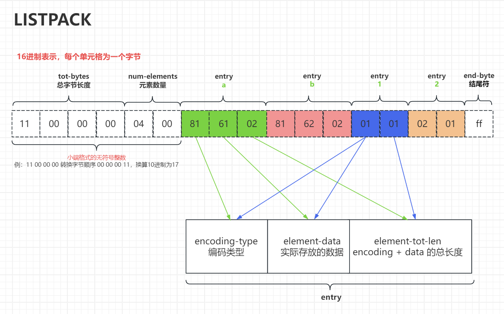

```纯文本
11 00 00 00：小端格式，转化为十进制为17，表示总字节数为17
04 00 ：小端格式，元素个数为4
81 61 02：根据<entry结构图表>和<encoding-type规则图表>，
          81二进制为10000001，前两位为10则表示数据为字符串，后6位则表示字符串长度为1，
          61表示具体数据‘a’(ascii),
          02表示<encoding-type>+<element-data>总长度
81 62 02：解析同上，62表示具体数据‘b’
01 01：根据<entry结构图表>和<encoding-type规则图表>，
       01二进制为00000001，第一位为0则表示数据为无符号整数，后7为0000001表示整数1，
       01表示<encoding-type>+<element-data>总长度
02 01：解析同上，
       02二进制为00000002，第一位为0则表示数据为无符号整数，后7为0000002表示整数2，
ff：结尾符
```

<u>7.封装类型-ZIPMAP</u>

结构图表:

| ZIPMAP      | zmlen                                                        | enrty                  | end             |
| ----------- | ------------------------------------------------------------ | ---------------------- | --------------- |
| 长度(个数） | 固定长度 1字节                                               | 长度见\<entry结构图表> | 固定长度 1 字节 |
| 描述        | zipmap中的元素数量，无符号整型数,最多仅仅能表示253个键值对。当元素数量大于或等于254时，仅仅能通过遍历一遍zipmap来确定其大小。 | 数据内容               | 结尾符          |

entry结构图表:

| entry      | key length         | key                | value length       | free                                                         | value              |
| ---------- | ------------------ | ------------------ | ------------------ | ------------------------------------------------------------ | ------------------ |
| 长度(个数) | 长度见\$LENGTH规则 | 长度见\$STRING规则 | 长度见\$LENGTH规则 | 固定长度 1字节                                               | 长度见\$STRING规则 |
| 描述       | key的长度编码      | key                | value的长度编码    | free表示随后的value后面的空暇字节数。&#xA;比方：假设zipmap存在”foo” => “bar”这样一个键值对，随后我们将“bar”设置为“hi”。此时free = 1，表示value字符串后面有1个字节大小的空暇空间。&#xA;free字段是一个占1个字节的整型数，它的值一般都比較小。假设空暇区间太大，zipmap会进行调整以使整个map尽可能小，这个过程发生在zipmapSet操作中。 | value              |

<u>8.封装类型-INTSET</u>

类型描述：

用于存储redis中SET类型数据，仅支持整数类型的存储。

结构图表:

| INTSET     | encode                                                       | length-of-contents            | entry ...                                        |
| ---------- | ------------------------------------------------------------ | ----------------------------- | ------------------------------------------------ |
| 长度(个数) | 固定长度 4 字节 Little-Endian                                | 固定长度 4 字节 Little-Endian | 长度见\<encode规则图表>                          |
| 描述       | encode编码规则见\<encode规则图表>&#xA;注：如果元素占用字节不同，按照最大占用字节取编码规则 | 元素个数                      | 具体元素                           Little-Endian |

encode规则图表：

| encode      | 元素占用字节数 |
| ----------- | -------------- |
| 02 00 00 00 | 2              |
| 04 00 00 00 | 4              |
| 08 00 00 00 | 8              |

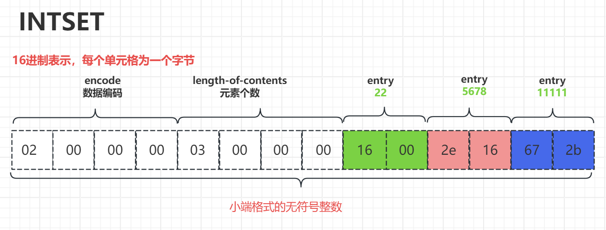

```纯文本
02 00 00 00：根据encode数据编码规则可知，entry为两字节
03 00 00 00：元素个数为3
16 00：小端格式，转化后为0016，转为十进制为22
2e 16：小端格式，转化后为162e，转为十进制为5678
67 2b：小端格式，转化后为2b67，转为十进制为11111
```

<u>9.对象类型-LIST</u>

类型描述：

用于存储redis中LIST类型数据。

结构图表：

| LIST       | len                | content            |
| ---------- | ------------------ | ------------------ |
| 长度(个数) | 长度见\$LENGTH规则 | 长度见\$STRING规则 |
| 描述       | 元素个数           | 元素               |

图解示例：

```纯文本
0000000 001 004   k   e   y   1 002 001   a 001   b
         01  04  6b  65  79  31  02  01  61  01  62

```


```纯文本
01：rdb类型为LIST
04:键的长度，采用$LENGTH编码规则，转换为十进制为4，所以键的长度为4
6b  65  79  31:键key1
02：list元素的个数
61：元素‘a’
62：元素‘b’
```

<u>10.对象类型-LIST\_ZIPLIST</u>

类型描述：

用于存储redis中LIST类型数据。

结构图表：

| LIST\_ZIPLIST | content            |
| ------------- | ------------------ |
| 长度(个数)    | 长度见\$STRING规则 |
| 描述          | ZIPLIST结构        |

```纯文本
016 004   l   i   s   t  021
0e  04  6c  69  73  74   11
021  \0  \0  \0  \r  \0  \0  \0 002  \0  \0 001   b 003 001  a 377
11  00  00  00  0d  00  00  00  02  00  00  01  62  03  01  61  ff
```

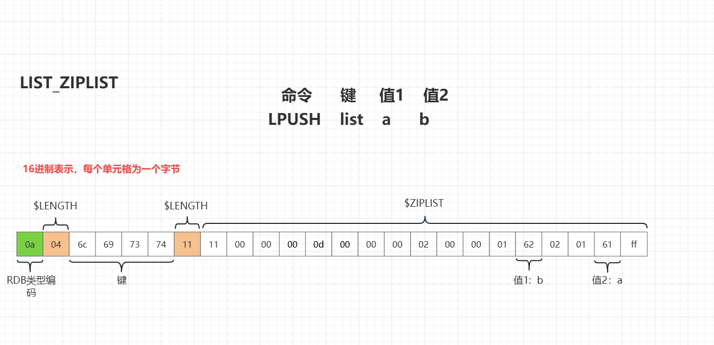

```
0a：rdb类型为LIST_ZIPLIST
04:键的长度，采用$LENGTH编码规则
6c  69  73  74  :键'list'

11：采用$LENGTH编码规则
11  00  00  00  .....:见ZIPLIST结构解析规则
```

<u>11.对象类型-LIST\_QUICKLIST</u>

类型描述：

用于存储redis中LIST类型数据。

结构图表：

| LIST\_QUICKLIST | len                | content            |
| --------------- | ------------------ | ------------------ |
| 长度(个数)      | 长度见\$LENGTH规则 | 长度见\$STRING规则 |
| 描述            | ZIPLIST个数        | ZIPLIST结构        |

```纯文本
0000000 016 005   t   e   s   t   q 001 026 026  \0  \0  \0 023  \0  \0
         0e  05  74  65  73  74  71  01  16  16  00  00  00  13  00  00
0000020  \0 003  \0  \0 004   b   b   b   b 006 001   a 003 362 377
         00  03  00  00  04  62  62  62  62  06  01  61  03  f2  ff
```

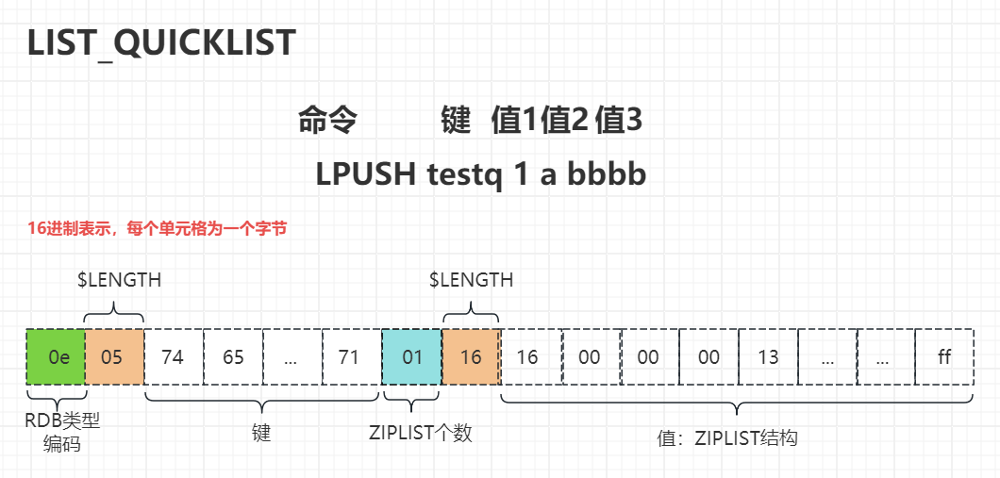

```纯文本
0e：rdb类型为LIST_QUICKLIST
05:键的长度，采用$LENGTH编码规则
74  65  73  74  71:键'testq'
01：ziplist的个数
16：采用$LENGTH编码规则
16  00  00  00  13  00  00  00  03  00  
00  04  62  62  62  62  06  01  61  03  f2  ff:见ZIPLIST结构解析规则

```

<u>12.对象类型-LIST\_QUICKLIST\_2</u>

类型描述：

用于存储redis中LIST类型数据。

结构图表：

| LIST\_QUICKLIST\_2 | len                | container                                  | content                            |
| ------------------ | ------------------ | ------------------------------------------ | ---------------------------------- |
| 长度(个数)         | 长度见\$LENGTH规则 | 固定长度 1 字节                            | 长度见\$STRING规则                 |
| 描述               | LISTPACK个数       | 01则数据为LIST结构，02则数据为LISTPACK结构 | 详见entry1结构图表和entry2结构图表 |

entry1结构图表：

| entry1 | content            |
| ------ | ------------------ |
| 长度   | 长度见\$STRING规则 |
| 描述   | 详见LIST结构解析   |

entry2结构图表：

| entry2 | content              |
| ------ | -------------------- |
| 长度   | 长度见\$STRING规则   |
| 描述   | 详见LISTPACK结构解析 |

图解示例：

```纯文本
0000000 022 005   k   e   y   1   2 001 002 024 024  \0  \0  \0 003  \0
         12  05  6b  65  79  31  32  01  02  14  14  00  00  00  03  00
0000020 203 347 224 267 004 201   a 002 362  \0 200  \0 004 377
         83  e7  94  b7  04  81  61  02  f2  00  80  00  04  ff

```

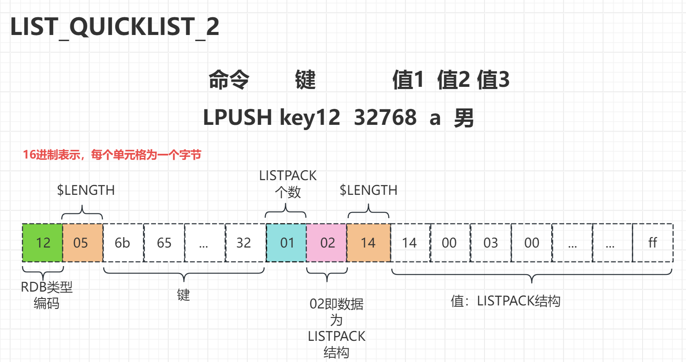

```纯文本
12：rdb类型为LIST_QUICKLIST_2
05:键的长度，采用$LENGTH编码规则，转换为十进制为5，所以键的长度为5
6b  65  79  31  32:键'key12'
01：listpack的个数
02：为2的时候使用listpack编码规则
14：采用$LENGTH编码规则，转换为十进制为20，所以值的长度为20
整体为字符串编码规则（具体使用listpack编码规则）
14  00  00  00：总字节长度为14转换成2进制为20
03  00：元素个数
83  e7  94  b7  04：encoding-type(10 000011，前两位为10，表示当前元素为字符串，后六位表示字符串长度，则字符串长度为3字节)
                    +data(e7  94  b7：男)
                    +element-lot-len(4)
81  61  02：encoding-type(10 000001，前两位为10，表示当前元素为字符串，后六位表示字符串长度，则字符串长度为1字节)
            +data(61：a)
            +element-lot-len(2)
f2  00  80  00  04：encoding-type(11110010，前八位为11110010，表示当前元素为有符号整数，则后面3个字节为具体数值)
                    +data(00  80  00：32768)
                    +element-lot-len(4)
ff:结尾符
```

<u>13.对象类型-SET</u>

类型描述：

用于存储redis中SET类型数据。

结构图表：

| SET        | len                | content            |
| ---------- | ------------------ | ------------------ |
| 长度(个数) | 长度见\$LENGTH规则 | 长度见\$STRING规则 |
| 描述       | 元素个数           | 元素               |

图解示例：

```纯文本
0000000 002  \n   t   e   s   t   s   e   t 004 300 001 001   a 301 017
         02  0a  74  65  73  74  73  65  74  04  c0  01  01  61  c1  0f
0000020   ' 300 002
         27  c0  02

```

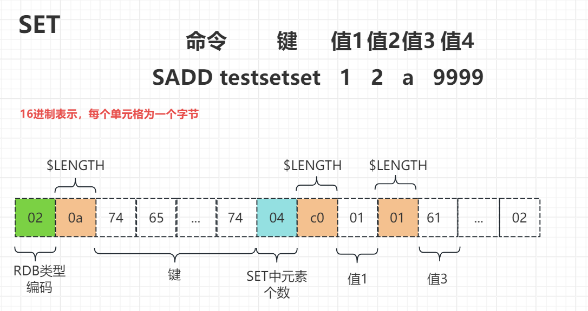

```纯文本
02：表示rdb_type为SET
0a：长度编码（00001010）
74  65  73  74  73  65  74  73  65  74:key值'testsetset'
04：元素个数（采用长度编码规则）
c0：采用$LENGTH编码规则（11000000）
01：value值（整数）'1'
01：采用$LENGTH编码规则（00000001）
61：value值(字符串)'a'
c1：采用$LENGTH编码规则（11000001）
0f  27：value值（整数-270f）'9999'
c0：采用$LENGTH编码规则（11000000）  
02：value值（整数）'2'

```

<u>14.对象类型-SET\_INTSET</u>

类型描述：

用于存储redis中SET类型数据，仅支持整数类型的存储。

结构图表:

| SET-INTSET | content            |
| ---------- | ------------------ |
| 长度(个数) | 长度见\$STRING规则 |
| 描述       | INTSET结构         |

图解示例：

```纯文本
0000000  \v  \n   t   e   s   t   i   n   t   s   e   t 016 002  \0  \0
         0b  0a  74  65  73  74  69  6e  74  73  65  74  0e  02  00  00
0000020  \0 003  \0  \0  \0 026  \0   . 026   g   +
         00  03  00  00  00  16  00  2e  16  67  2b

```


```纯文本
Ob：SET-INSET的RDB类型编码为0b
0a：键的长度，采用$LENGTH编码规则，转换为十进制为10，所以键的长度为10
74  65  73  74  69  6e  74  73  65  74：键 testintset
0e：值的长度，采用$LENGTH编码规则，转换为十进制为14，所以键的长度为14
02  00  00  00  03  00  00  00  16  00  2e  16  67  2b：值，见INTSET结构解析规则

```

<u>15.对象类型-SET\_LISTPACK</u>

类型描述：

用于存储redis中SET类型数据，仅支持整数类型的存储。

结构图表:

| SET-LISTPACK | content            |
| ------------ | ------------------ |
| 长度(个数)   | 长度见\$STRING规则 |
| 描述         | LISTPACK结构       |

图解示例：

```纯文本
0000000 024 005   k   e   y   1   4 024 024  \0  \0  \0 003  \0 362  \0
         14  05  6b  65  79  31  34  14  14  00  00  00  03  00  f2  00
0000020 200  \0 004 201   a 002 203 347 224 267 004 377
         80  00  04  81  61  02  83  e7  94  b7  04  ff
```

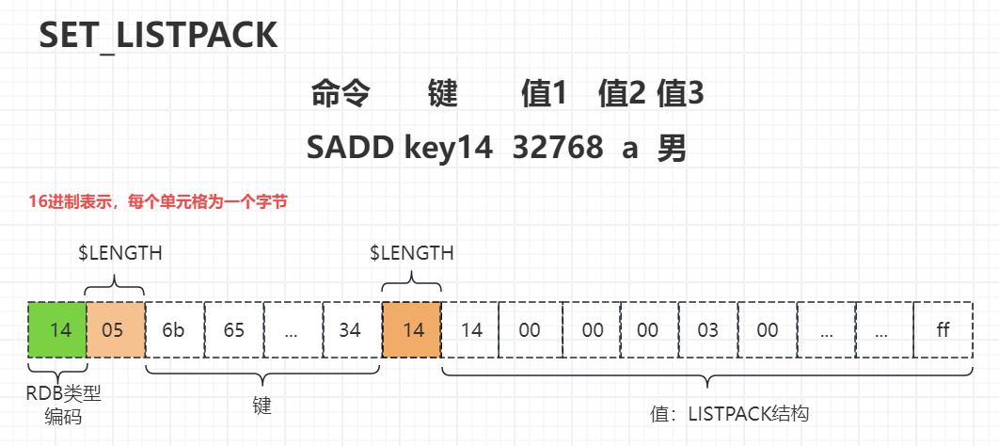

```纯文本
14：rdb类型为SET_LISTPACK
05：键的长度，采用$LENGTH编码规则
6b  65  79  31  34：键'key14'
14：值的长度，采用$LENGTH编码规则
14  00  00  00  03  00  
f2  00  80  00  04  81  61  02  83  e7  94  b7  04  ff：见LISTPACK结构解析规则

```

<u>16.对象类型-ZSET</u>

类型描述：

用于存储redis中ZSET类型数据。

结构图表：

| ZSET       | len                | content            | score                    |
| ---------- | ------------------ | ------------------ | ------------------------ |
| 长度(个数) | 长度见\$LENGTH规则 | 长度见\$STRING规则 |                          |
| 描述       | 元素个数           | 元素               | 将该字符串转换为双精度型 |

图解示例：

<u>17.对象类型-ZSET\_2</u>

类型描述：

用于存储redis中ZSET类型数据。

结构图表：

| ZSET       | len                | content            | score                    |
| ---------- | ------------------ | ------------------ | ------------------------ |
| 长度(个数) | 长度见\$LENGTH规则 | 长度见\$STRING规则 | 固定长度8字节            |
| 描述       | 元素个数           | 元素               | 将该字符串转换为双精度型 |

图解示例：

<u>18.对象类型-ZSET\_ZIPLIST</u>

类型描述：

用于存储redis中ZSET类型数据。

结构图表：

| ZSET\_ZIPLIST | len                | content            |
| ------------- | ------------------ | ------------------ |
| 长度(个数)    | 长度见\$LENGTH规则 | 长度见\$STRING规则 |
| 描述          | 长度编码           | ZIPLIST结构        |

图解示例：

```纯文本
0000000  \f 005   k   e   y   3   3 037 037  \0  \0  \0 033  \0  \0  \0
         0c  05  6b  65  79  33  33  1f  1f  00  00  00  1b  00  00  00
0000020 006  \0  \0 002   m   1 004 373 002 002   m   2 004 376 024 003
         06  00  00  02  6d  31  04  fb  02  02  6d  32  04  fe  14  03
0000040 002   m   3 004 376 036 377
         02  6d  33  04  fe  1e  ff
```

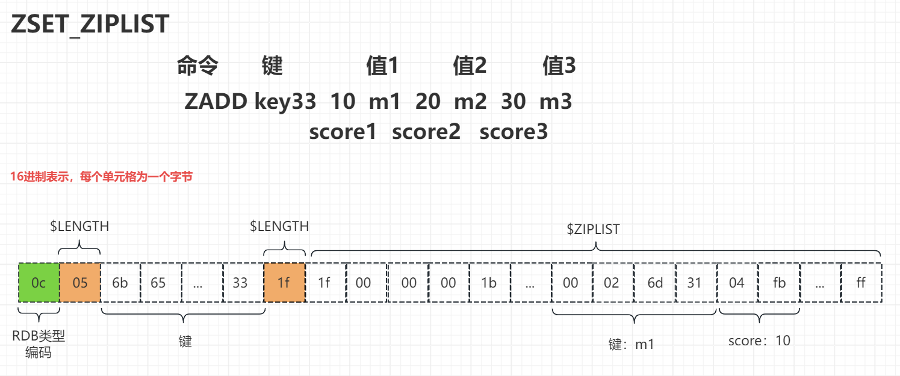

```纯文本
0c：表示rdb_type为ZSET_ZIPLIST
05：采用$LENGTH编码规则
6b  65  79  33  33：key值'key33'
1f：采用$LENGTH编码规则
1f  00  00  00  1b  00  00  00  06  00  
00  02  6d  31  04  fb  02  02  6d  32
04  fe  14  03  02  6d  33  04  fe  1e  ff :见ZIPLIST结构解析规则,
即value1'm1' score'10'，value2'm2' score'20'，value3'm3' score'30'

```

<u>19.对象类型-ZSET\_LISTPACK</u>

类型描述：

用于存储redis中ZSET类型数据。

结构图表：

| ZSET\_LISTPACK | len                | content            |
| -------------- | ------------------ | ------------------ |
| 长度(个数)     | 长度见\$LENGTH规则 | 长度见\$STRING规则 |
| 描述           | 长度编码           | LISTPACK结构       |

图解示例：

```纯文本
0000000 021 005   k   e   y   3   3 031 031  \0  \0  \0 006  \0 202   m
         11  05  6b  65  79  33  33  19  19  00  00  00  06  00  82  6d
0000020   1 003  \n 001 202   m   2 003 024 001 202   m   3 003 036 001
         31  03  0a  01  82  6d  32  03  14  01  82  6d  33  03  1e  01
0000040 377  
         ff  
```

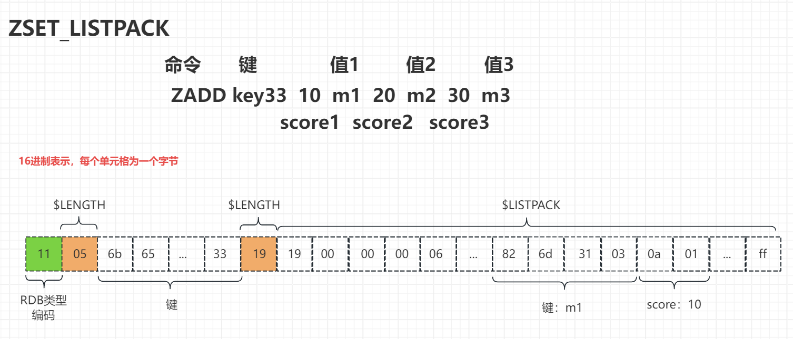

```纯文本
11：表示rdb_type为ZSET_LISTPACK
05：采用$LENGTH编码规则
6b  65  79  33  33：key值'key33'
19：采用$LENGTH编码规则
19  00  00  00  06  00  
82  6d  31  03  0a  01  82  6d  32  03  14  01  82  6d  33  03  1e  01  ff：见LISTPACK结构解析规则,
即value1'm1' score'10'，value2'm2' score'20'，value3'm3' score'30'

```

<u>20.对象类型-HASH</u>

类型描述：

用于存储redis中HASH类型数据。

结构图表：

| HASH       | len                | content            |
| ---------- | ------------------ | ------------------ |
| 长度(个数) | 长度见\$LENGTH规则 | 长度见\$STRING规则 |
| 描述       | 元素个数           | 元素               |

图解示例：

```纯文本
0000000 004 004   u   s   e   r 001 004   n   a   m   e 003   z   z   h
         04  04  75  73  65  72  01  04  6e  61  6d  65  03  7a  7a  68
```

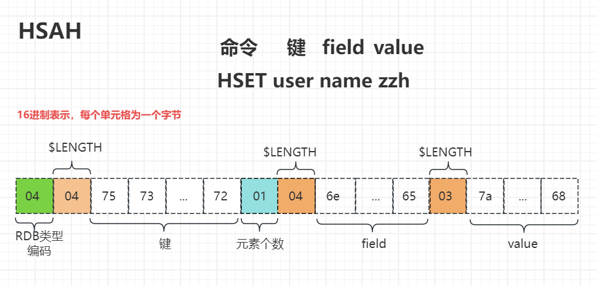

```纯文本
04：表示rdb_type为HASH
04：采用$LENGTH编码规则
75  73  65  72：key值'user'
01：采用$LENGTH编码规则，元素个数
04：采用$LENGTH编码规则
6e  61  6d  65：field为'name'
03：采用$LENGTH编码规则
7a  7a  68：value为'zzh'

```

<u>21.对象类型HASH\_ZIPMAP</u>

1.字符串长度（采用length长度编码规则）

2.字符串内容(该字符串的内容代表 zipmap，zipmap解析同上)

<u>22.对象类型-HASH\_ZIPLIST</u>

类型描述：

用于存储redis中HASH类型数据。在Redis<7.x版本适用

结构图表：

| HASH\_ZIPLIST | content            |
| ------------- | ------------------ |
| 长度(个数)    | 长度见\$STRING规则 |
| 描述          | ZIPLIST结构        |

```纯文本
\r 004   h   a   s   h 031 031
0d  04  68  61  73  68  19  19
\0  \0  \0 020  \0  \0  \0 002  \0  \0 004   k   e   y   1 006
00  00  00  10  00  00  00  02  00  00  04  6b  65  79  31  06
006   v   a   l   u   e   1 377 
06  76  61  6c  75  65  31  ff
```

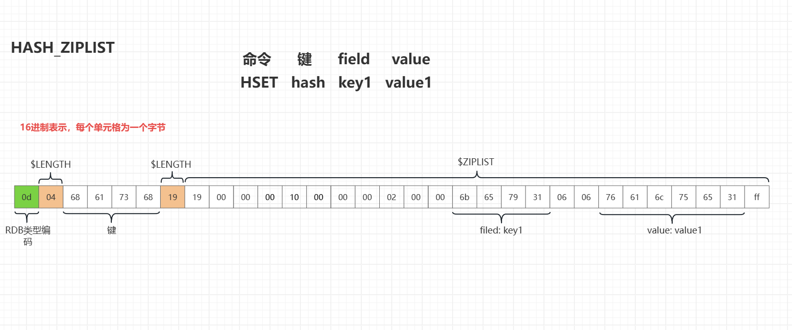

```
0d：表示rdb_type为HAASH_ZIPLIST
04：采用$LENGTH编码规则
68  61  73  68 ：key值'key1'
19：采用$LENGTH编码规则
19  00  00  00  .... ：见LISTPACK结构解析规则, 即filead 'key1' value 'value1'
```

<u>23.对象类型-HASH\_LISTPACK</u>

类型描述：

用于存储redis中HASH类型数据。

结构图表：

| HASH\_LISTPACK | len                | content            |
| -------------- | ------------------ | ------------------ |
| 长度(个数)     | 长度见\$LENGTH规则 | 长度见\$STRING规则 |
| 描述           | 长度编码           | LISTPACK结构       |

图解示例：

```纯文本
0000000 020 004   u   s   e   r 022 022  \0  \0  \0 002  \0 204   n   a
         10  04  75  73  65  72  12  12  00  00  00  02  00  84  6e  61
0000020   m   e 005 203   z   z   h 004 377
         6d  65  05  83  7a  7a  68  04  ff
```


```纯文本
10：表示rdb_type为HASH_LISTPACK
04：采用$LENGTH编码规则
75  73  65  72：key值'user'
12：采用$LENGTH编码规则
12  00  00  00  02  00 
84  6e  61  6d  65  05  83  7a  7a  68  04  ff:见LISTPACK结构解析规则,
key为'name'，value为'zzh'
```

<u>24.对象类型-STREAM\_LISTPACKS</u>

详见STREAM\_LISTPACKS\_3(15)

差异见<aux结构图表><groups结构图表>

<u>25.对象类型-STREAM\_LISTPACKS\_2</u>

详见STREAM\_LISTPACKS\_3(15)

差异见<aux结构图表><groups结构图表>

<u>26.对象类型-STREAM\_LISTPACKS\_3</u>

类型描述：

用于存储redis中STREAM类型数据。

结构图表：

| STREAM\_LISTPACKS\_3 | entries                | aux                | groups                |
| -------------------- | ---------------------- | ------------------ | --------------------- |
| 长度(个数)           | 详见\<entries结构图表> | 详见\<aux结构图表> | 详见\<groups结构图表> |
| 描述                 | 流元素                 | 属性字段值         | 消费者组              |

entries结构图表:

| entries    | len                | entry...           |
| ---------- | ------------------ | ------------------ |
| 长度(个数) | 长度见\$LENGTH规则 | 长度见\$STRING规则 |
| 描述       | entry个数          | 详见\<entry>       |

| entry      | baseId                        | listPack                                                     |
| ---------- | ----------------------------- | ------------------------------------------------------------ |
| 长度(个数) | 长度见\$STRING规则            | 详见<listPack元素结构图表>                                   |
| 描述       | 1字节$LENGTH+8字节ms+8字节seq | LISTPACK结构:\<total-bytes>\<num-elements>\<elements:listPack元素结构图表>\<end> |

listPack元素结构图表：

| listPack元素信息描述(第x个元素） | 描述                                                         |
| -------------------------------- | ------------------------------------------------------------ |
| 1                                | 有效消息个数(与删除元素个数之和为当前listpack消息总个数)     |
| 2                                | 删除消息个数(与有效元素个数之和为当前listpack消息总个数)     |
| 3                                | 通用属性个数，消息内容为json结构，当前Listpack第一条消息的key的个数，作为通用的消息个数 |
| 4 ...                            | 通用属性列表，根据<3>通用属性个数，也就是json所有的key列表   |
| 5                                | 类型描述，固定1个字节，字节的倒数第二位决定是否是相似属性的消息，0不是 1是；字节的倒数第一位决定是否是已删除的消息 0 不是 1是。相似属性的消息是指消息的json结构拥有和<4>通用属性列表具有完全相同的属性个数和属性名称，相似属性的消息，不再在rdb中记录json中的key，而是直接使用通用属性列表的key。 |
| 6                                | 首个消息的ms增长量，增长量+baseID.ms为首个消息的ms,<6>-<7>组合为消息的唯一ID结构为'ms-seq' |
| 7                                | 首个消息的seq增长量,增长量+baseID.seq为首个消息的seq,<6>-<7>组合为消息的唯一ID结构为'ms-seq' |
| 8...                             | 首个消息的属性值，即消息体json结构中的value，数量同通用属性个数 |
| 9                                | 首个消息涉及的ListPack中的元素个数，首个消息为<5>到<8>的元素个数 |
| 开始循环解析                     | <10>到<16>循环解析                                           |
| 10                               | 类型描述，同<5>                                              |
| 11                               | 消息的ms增长量，同<6>                                        |
| 12                               | 消息的seq增长量，同<7>                                       |
| 13                               | 属性个数，如果当前元素符合相似属性的消息，则当前消息的属性个数同通用属性个数，此时当前元素不存在；如果当前元素不符合相似属性的消息，则当前元素为属性个数 |
| 14...                            | 属性列表，也就是json所有的key列表，如果当前元素符合相似属性的消息，则当前消息的属性列表同<4>通用属性列表，此时当前元素不存在；如果当前元素不符合相似属性的消息，则当前元素存在。与<15>交替出现 |
| 15...                            | 属性值，即消息体json结构中的value，与<14>交替出现            |
| 16                               | 当前消息涉及的ListPack中的元素个数，首个消息为<10>到<15>的元素个数 |

FLAG结构图表：

| FLAG       | flags                                                        | entry-id         |
| ---------- | ------------------------------------------------------------ | ---------------- |
| 长度(个数) | 固定长度 1字节                                               | 固定长度 16字节  |
| 描述       | 倒数第二位决定是否是相似的属性 0不是 1是 ，倒数第一位决定状态是否是已删除 0不是 1是 | 8字节ms+8字节seq |

aux结构图表：

| aux        | len                   | lastId                                | firstId                                        | maxDeletedEntryId                     | entriesAdded          |
| ---------- | --------------------- | ------------------------------------- | ---------------------------------------------- | ------------------------------------- | --------------------- |
| 长度(个数) | 长度见$LENGTH编码规则 | 长度见\$LENGTH规则+长度见\$LENGTH规则 | 长度见\$LENGTH规则+长度见\$LENGTH规则          | 长度见\$LENGTH规则+长度见\$LENGTH规则 | 长度见$LENGTH编码规则 |
| 描述       | 消息总数              | 最后一条消息的ID                      | 第一条消息的ID                                 | 最大已删除的数据的ID                  | 所有数据的数量        |
| 版本差异   |                       |                                       | STREAM\_LISTPACKS\_2和STREAM\_LISTPACKS\_3才有 |                                       |                       |

groups结构图表：

| groups     | groupCount            | group-name         | group-last-id                   | entriesRead                                    | gpel-length        | gpel...                               | consumer-length     | consumer...             | end            |
| ---------- | --------------------- | ------------------ | ------------------------------- | ---------------------------------------------- | ------------------ | ------------------------------------- | ------------------- | ----------------------- | -------------- |
| 长度(个数) | 长度见$LENGTH编码规则 | 长度见\$STRING规则 |                                 |                                                | 长度见\$LENGTH规则 | 详见\<gpel结构图表>                   | 长度见\$LENGTH规则  | 详见\<consumer结构图表> | 固定长度 1字节 |
| 描述       | group数量             |                    | 当前group读取的最后一条消息的ID | 当前group读取了多少条数据                      | 全局密钥数量       | [密钥相关内容，密钥数量为0时，不存在] | 这个group的成员数量 |                         | ff             |
| 版本差异   |                       |                    |                                 | STREAM\_LISTPACKS\_2和STREAM\_LISTPACKS\_3才有 |                    |                                       |                     |                         |                |

gpel结构图表：

| gpel       | entry-id         | delivery-time                                            | delivery-count     |
| ---------- | ---------------- | -------------------------------------------------------- | ------------------ |
| 长度(个数) | 固定长度 16字节  | 固定长度 8字节                                           | 长度见\$LENGTH规则 |
| 描述       | 条目的stream- id | 该数字是精度为毫秒的 unix 时间戳，表示此密钥的到期时间。 |                    |

consumer结构图表：

| consumer   | consumer-name      | seen-time                                                | activeTime               | cpel-len           | cpel...                               |
| ---------- | ------------------ | -------------------------------------------------------- | ------------------------ | ------------------ | ------------------------------------- |
| 长度(个数) | 长度见\$STRING规则 | 固定长度 8字节                                           |                          | 长度见\$LENGTH规则 |                                       |
| 描述       |                    | 该数字是精度为毫秒的 unix 时间戳，表示此密钥的到期时间。 |                          |                    | [密钥相关内容，密钥数量为0时，不存在] |
| 版本差异   |                    |                                                          | STREAM\_LISTPACKS\_3才有 |                    |                                       |

图解示例：

```
0000000 025 002   s   1 001 020  \0  \0 001 217 314 224   3 317  \0  \0
         15  02  73  31  01  10  00  00  01  8f  cc  94  33  cf  00  00
0000020  \0  \0  \0  \0  \0  \0   @   a   a  \0  \0  \0 037  \0 004 001
         00  00  00  00  00  00  40  61  61  00  00  00  1f  00  04  01
0000040  \0 001 001 001 203   a   a   a 004  \0 001 002 001  \0 001  \0
         00  01  01  01  83  61  61  61  04  00  01  02  01  00  01  00
0000060 001 203   b   b   b 004 004 001  \0 001 361 350   % 003  \0 001
         01  83  62  62  62  04  04  01  00  01  f1  e8  25  03  00  01
0000080 001 001 202   c   c 003 202   d   d 003 006 001 002 001 361 375
         01  01  82  63  63  03  82  64  64  03  06  01  02  01  f1  fd
0000100   ; 003  \0 001 203   o   o   o 004 004 001  \0 001 361 022   e
         3b  03  00  01  83  6f  6f  6f  04  04  01  00  01  f1  12  65
0000120 003  \0 001 002 001 202   e   e 003 202   r   r 003 202   f   f
         03  00  01  02  01  82  65  65  03  82  72  72  03  82  66  66
0000140 003 203   g   g   g 004  \b 001 377 004 201  \0  \0 001 217 314
         03  83  67  67  67  04  08  01  ff  04  81  00  00  01  8f  cc
0000160 224 230 341  \0 201  \0  \0 001 217 314 224   3 317  \0  \0  \0
         94  98  e1  00  81  00  00  01  8f  cc  94  33  cf  00  00  00
0000180 004 001 002   g   1  \0  \0  \0  \0 002 006   m   a   o   m   a
         04  01  02  67  31  00  00  00  00  02  06  6d  61  6f  6d  61
0000200   o 372 206 230 314 217 001  \0  \0 377 377 377 377 377 377 377
         6f  fa  86  98  cc  8f  01  00  00  ff  ff  ff  ff  ff  ff  ff
0000210 377  \0  \b   x   i   a   o   f   a   n   g   [   q 230 314 217
         ff  00  08  78  69  61  6f  66  61  6e  67  5b  71  98  cc  8f
0000220 001  \0  \0 377 377 377 377 377 377 377 377  \0
         01  00  00  ff  ff  ff  ff  ff  ff  ff  ff  00
```

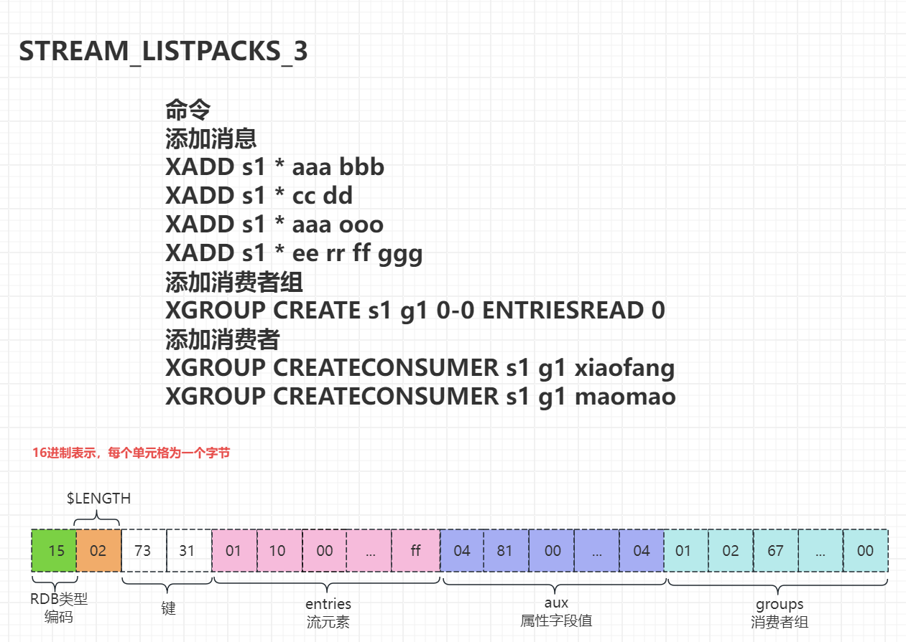

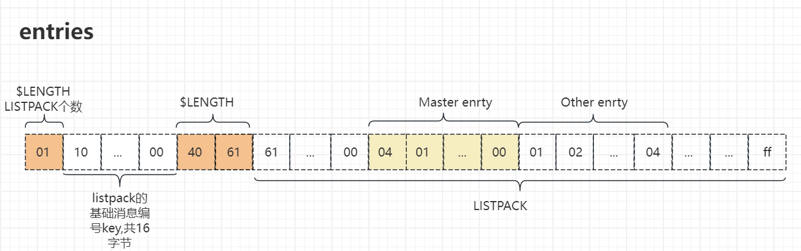

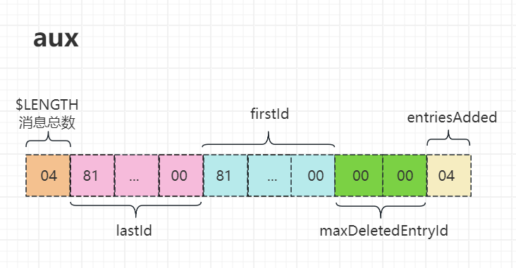

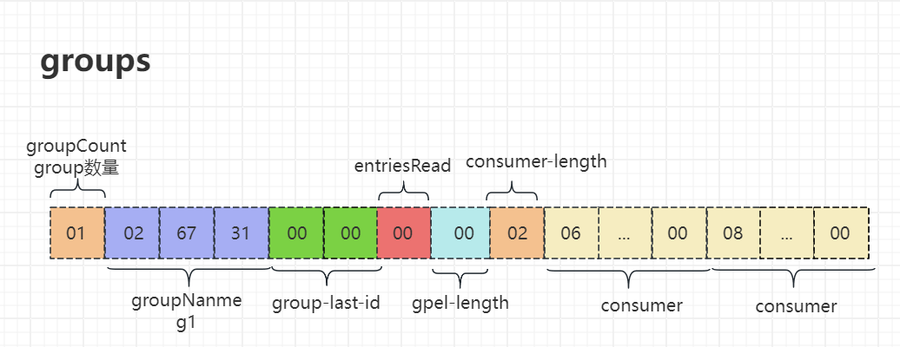

```
15：表示rdb_type为STREAM_LISTPACKS_3
02  73  31：采用$STRING编码规则，key值's1'

entries
01：采用$LENGTH编码规则，表示LISTPACK个数
10  00  00  01  8f  cc  94 33  cf  00  00  00  00  00  00  00  00：采用$STRING编码规则，表示listpack的基础消息编号key，8字节ms+8字节seq,long-long，大端
40  61：采用$LENGTH编码规则，表示下一个listpack字符串长度
listpack:
61  00  00  00 ：listpack总长，97，小端
1f  00：listpack数量元素数量，31个元素，小端
以下为根据<LISTPACK>-<entry结构图表>解析出的具体数值
***Master entry第一个元素比较特殊***
<4>：count有效元素个数
<0>：deleted已删除元素个数
<1>：numFields第一个元素的有几个属性值,紧接着有连续多少个属性名称
<aaa>：key
<0>：end间隔，无意义字符
***Other entry***
<2>：flags,00000010 倒数第二位决定是否是相似的属性 0不是 1是  倒数第一位决定状态是否是已删除 0不是 1是
<0>：ms  1717124215759 + 0
<0>：seq 0 + 0    
<bbb>：属性值
<4>：上一个元素使用的多少entry
<0>：00000000 倒数第二位决定是否是相似的属性 0不是 1是  倒数第一位决定状态是否是已删除 0不是 1是
<9704>：ms 1717124215759 + 9704
<0>：seq 0 + 0
<1>：属性个数
<cc>：属性1的key
<dd>：属性1的vlaue
<6>：上一个元素使用的多少entry
<2>：00000010 倒数第二位决定是否是相似的属性 0不是 1是  倒数第一位决定状态是否是已删除 0不是 1是
<15357>：ms  1717124215759 + 15357
<0>：seq 0 + 0
<ooo>：属性值
<4>：上一个元素使用的多少entry
<0>：00000000 倒数第二位决定是否是相似的属性 0不是 1是  倒数第一位决定状态是否是已删除 0不是 1是
<25874>：ms 1717124215759 + 25874
<0>：seq 0 + 0
<2>：属性个数 
<ee>：属性1的key
<rr>：属性1的vlaue
<ff>：属性2的key
<ggg>：属性2的vlaue
<8>：上一个元素使用的多少entry
ff：listpack结束符 包含在listpack总长内

Aux
04：采用$LENGTH编码规则，消息总数
81  00  00  01  8f  cc  94  98  e1   00：采用$LENGTH规则+$LENGTH规则，lastId最后一条消息的ID 1717117166984-0
81  00  00  01  8f  cc  94  33  cf   00：采用$LENGTH规则+$LENGTH规则，firstId第一条消息的ID 1717117166984-0 (2、3版本才有）
00  00：采用$LENGTH规则+$LENGTH规则，maxDeletedEntryId最大已删除的数据的ID 0-0
04：entriesAdded一共添加了多少条数据进去 4 

groups 
01：采用$LENGTH编码规则，group数量
第一个group
02  67  31：采用$STRING编码规则 group的名字g1
00    00：采用$LENGTH编码规则，当前group读取的最后一条消息的ID 0-0
00：当前group读取了多少条数据   (2、3版本才有）
00：全局密钥数量
[密钥相关内容，密钥数量为0时，不存在]
02：这个group的成员数量
***循环***
consumer
06  6d 61  6f  6d  61  6f：采用$STRING编码规则 第一个成员名
fa  86  98  cc  8f  01  00  00：采用$millisecond编码规则，seenTime
ff  ff  ff ff  ff  ff ff ff：采用$millisecond编码规则，activeTime （3版本才有）
00 成员密钥数量
[密钥相关内容，密钥数量为0时，不存在]

08  78  69  61  6f  66  61  6e  67  采用$STRING编码规则 第一个成员名
5b 71  98  cc  8f  01  00  00：采用$millisecond编码规则seenTime
ff  ff  ff ff  ff  ff ff ff：采用$millisecond编码规则activeTime（3版本才有）
00 成员密钥数量   (3版本才有)
[密钥相关内容，密钥数量为0时，不存在]
```

<u>27.对象类型-MODULE</u>

类型描述：

用于存储redis中模型数据。

结构图表：

| MODULE     | len            | moduleId                | content          |
| ---------- | -------------- | ----------------------- | ---------------- |
| 长度(个数) | 固定长度1字节  | 固定长度8字节           |                  |
| 描述       | 十六进制值为81 | 详见\<moduleId结构图表> | 自定义模板解析器 |

moduleId结构图表：

| moduleId   | moduleName                                                   | moduleVersion                      |
| ---------- | ------------------------------------------------------------ | ---------------------------------- |
| 长度(个数) | 固定长度54位                                                 | 固定长度10位                       |
| 描述       | 前54位，每6位一组，根据附录\<MODULE\_SET>\[A-Za-z0-9-\_]得到moduleName | 最后10位 &1023 ，得到moduleVersion |

图解示例：

```纯文本
0000220   & 009   t   e   s   t   t   e   s   t 006 201   E 342   R   8
         06  09  74  65  73  74  74  65  73  74  06 81   45  e2  52  38
0000240 337 221   ,  \0
         df  91  2c  00
```

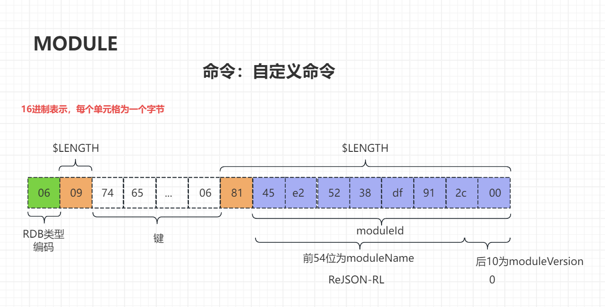

```纯文本
06：表示rdb_type为MODULE
09：采用$LENGTH编码规则
74  65  73  74  74  65  73  74  06：key值'testtest06'
81：采用$LENGTH编码规则,10000001后，八个字节表示长度
45  e2  52  38  df  91  2c  00 ：
01000101 
11100010 
01010010 
00111000 
11011111 
10010001 
00101100 
00000000
前54位，每6位一组：010001 011110 001001 010010 001110 001101 111110 010001 001011
转换成10进制：17 30 9 18 14 13 62 17 11，得到moduleName为‘ReJSON-RL’
最后10位：0000000000 &1023 ，得到moduleVersion是0
```

<u>28.对象类型-MODULE\_2</u>

类型描述：

用于存储redis中模型数据。

结构图表：

| MODULE\_2  | len            | moduleId                | content                                          |
| ---------- | -------------- | ----------------------- | ------------------------------------------------ |
| 长度(个数) | 固定长度1字节  | 固定长度8字节           |                                                  |
| 描述       | 十六进制值为81 | 详见\<moduleId结构图表> | 自定义模板解析器或详见\<nullModuleParser规则图表 |

nullModuleParser规则图表：

| \$LENGTH | 规则                                      |
| -------- | ----------------------------------------- |
| 0        | 表示后面无字节不需要继续读取，content结束 |
| 非0      | 读取下一个字节，详见\<opcode>             |

opcode规则图表：

| opcode | 规则                 |
| ------ | -------------------- |
| 1或2   | 采用\$LENGTH编码规则 |
| 3      | 采用\$STRING编码规则 |
| 4      | 跳过4字节            |
| 5      | 跳过8字节            |

图解示例：

```纯文本
0000220  \a 009   t   e   s   t   t   e   s   t 007 201   E 342   R   8
         07  09  74  65  73  74  74  65  73  74  07 81   45  e2  52  38
0000240 337 221   ,  \0 002     002 002 002   @ 200 005 004   n   a   m
         df  91  2c  00  02  20  02  02  02  40  80  05  04  6e  61  6d
0000260   e 002 002 005 003   z   z   h 002   @ 200 005 003   a   g   e
         65  02  02  05  03  7a  7a  68  02  40  80  05  03  61  67  65
0000300 002  \b 002 022  \0
         02  08  02  12  00
```

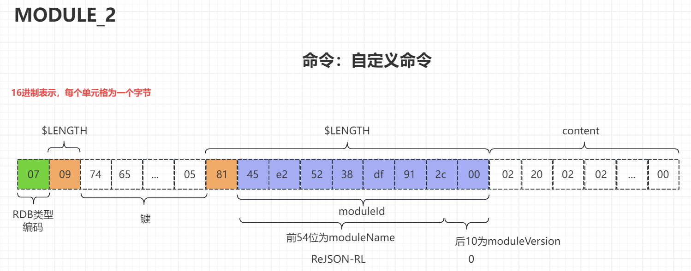

```纯文本
07：表示rdb_type为MODULE_2
09：采用$LENGTH编码规则
74  65  73  74  74  65  73  74  07：key值'testtest07'
81：采用$LENGTH编码规则,10000001后，八个字节表示长度
45  e2  52  38  df  91  2c  00 ：
01000101 
11100010 
01010010 
00111000 
11011111 
10010001 
00101100 
00000000
前54位，每6位一组：010001 011110 001001 010010 001110 001101 111110 010001 001011
转换成10进制：17 30 9 18 14 13 62 17 11，得到moduleName为‘ReJSON-RL’
最后10位：0000000000 &1023 ，得到moduleVersion是0
02：采用$LENGTH编码规则，00000010，后6位值不为0，表示后面有字节需要继续读取
20：采用$LENGTH编码规则，00100000，跳过$LENGTH
02：采用$LENGTH编码规则，00000010，后6位值不为0，表示后面有字节需要继续读取
02：采用$LENGTH编码规则，00000010，后6位值不为0，表示后面有字节需要继续读取
02：采用$LENGTH编码规则，00000010，后6位值不为0，表示后面有字节需要继续读取
40  80：采用$LENGTH编码规则，01000000，剩下6位和下一个字节80表示长度，跳过$LENGTH
05：采用$LENGTH编码规则，00000101，后六位000101为5，后面为$STRING
04  6e  61  6d   65：采用$STRING编码规则,'name'
02：采用$LENGTH编码规则，00000010，后6位值不为0，表示后面有字节需要继续读取
02：采用$LENGTH编码规则，00000010，后6位值不为0，表示后面有字节需要继续读取
05：采用$LENGTH编码规则，00000101，后六位000101为5，后面为$STRING
03  7a  7a  68：采用$STRING编码规则,'zzh'
02：采用$LENGTH编码规则，00000010，后六位000010为2，跳过$LENGTH
40 80：采用$LENGTH编码规则，01000000，剩下6位和下一个字节80表示长度，跳过$LENGTH
05：采用$LENGTH编码规则，00000101，后六位000101为5，后面为$STRING
03  61  67  65：采用$STRING编码规则,'age'
02：采用$LENGTH编码规则，00000010，后6位值不为0，表示后面有字节需要继续读取
08：采用$LENGTH编码规则，00001000，后6位值不为0，表示后面有字节需要继续读取
02：采用$LENGTH编码规则，00000010，后六位000010为2，跳过$LENGTH
12：采用$LENGTH编码规则，00010010，后六位010010为18，值为'18'
00：length0，表示后面无字节不需要继续读取，结束
```

###### 结束标志（0xFF ）

FF(25)是文件的 EOF 即结束标志，checksum CRC64校验码

```
FF AB D1 E6 72 8D FF 51 F1  FF(25)是文件的 EOF 即结束标志 随后的8位是CRC64 校验码：将 8 字节的 CRC 64 校验和添加到文件末尾。可以通过 redis.conf 中的参数禁用此校验和。 禁用校验和后，此字段将为零
```

## 主从同步

sync：全量复制，指的是从节点每次发起同步请求都会一次性同步主/从节点的所有数据（RDB流），然后在主/从从关系建立后保持指令同步。

psync：增量复制，指的是从节点可以根据主节点编号和指定偏移量从主/从节点同步部分数据（指令），然后在主/从从关系建立后保持指令同步。

我们测试了redis7、redis6、redis5、redis4、redis3、redis2.8等版本，从redis4开始支持psync增量复制。

主从同步流程（一下伪指令省略了resp协议格式化部分）：

```
从：PING
主：PONG
从：Auth 密码 （如果有密码）
主：OK
从：REPLCONF listening-port 从节点端口       #（redis4+）
主：OK
从：REPLCONF ip-address 从节点ip            #（redis4+）
主：OK
从：REPLCONF capa eof capa psync2          #从节点可以接收的数据协议类型（redis4+）
主：OK
	从：PSYNC 主节点编号 offset              #从节点发送自身偏移量，主节点会判断编号是否是自己，然后根据偏移量增量同步指令（redis4+）
	主：FULLRESYNC 主节点编号 offset || CONTINUE || CONTINUE 主节点编号 offset      
	                                      #这里主节点可能会有三种回复形式，对应全量同步和增量同步（redis4+）
	从：SYNC                               #从节点指定需要全量同步（redis3-）
主：RDB流                                  #主节点回复RDB流信息（整个RDB文件内容，可能分批次发送）
从：接收处理
主：PING
从：REPLCONF ACK offset                    #从节点每隔1秒回复自身偏移量
主：指令信息                                #主节点会将变更指令实时同步给从节点
从：REPLCONF ACK offset                    #从节点每隔1秒回复自身偏移量
```

## Redis相关配置

以下配置在增量同步场景下生效：

```
repl-backlog-size  #环形缓冲复制队列大小，可不带单位，但同时支持单位：b、k、kb、m、mb、g、gb
repl-backlog-ttl   #环形缓冲复制队列存活时长（所有slaves不可用时，保留repl_backlog多长时间，单位：秒）
```

## 流复制

基础组自研组件：Redis-x

### 同类型组件情况

**以下为统计github上打开的问题**，它们优点很多，但是我只统计了缺点。

阿里-RedisShake

​	不支持高可用，数据丢失，数据同步慢，go语言编写（技术栈差异）。

京东-RedisSyncer

​	不支持高可用，重复发送数据，offset点位错乱，数据丢失，最高支持Redis6.2版本。

携程-X-Pipe

​	仅支持Redis3.0.7版本。

#### 组件对比

| 组件           | redis-x               | alibaba shake                     |
| -------------- | --------------------- | --------------------------------- |
| 支持版本       | 2.8及以上             | 2.8及以上                         |
| 高可用         | 集群部署，纵向扩展    | 单机部署                          |
| 初始化同步方式 | 全量同步rdb，增量同步 | 全量同步rdb和aof，增量同步        |
| 支持续传       | 支持                  | 不支持                            |
| 数据类型       | 五种基本类型 + stream | 五种基本类型 + stream + 3种mudule |
| 其他功能       | 数据查询              | 数据筛选                          |

**注**：数据类型3种mudule，数据筛选功能后续支持。

10w tps下alibaba shake压测表现

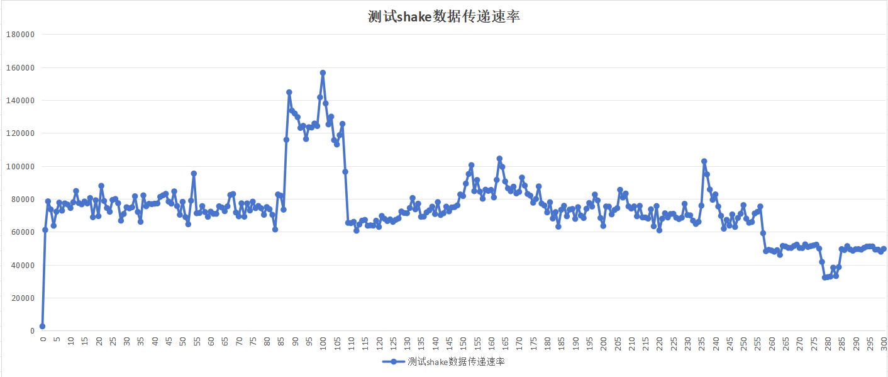

10w tps下alibaba shake控制台输出日志

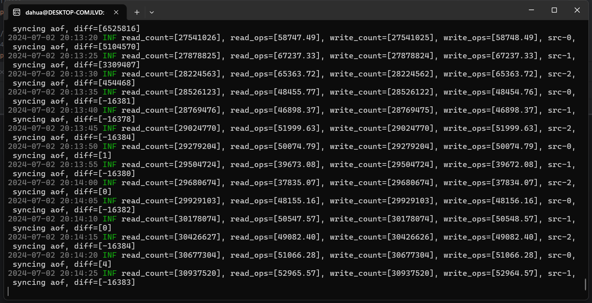

10w tps下redis-x压测表现

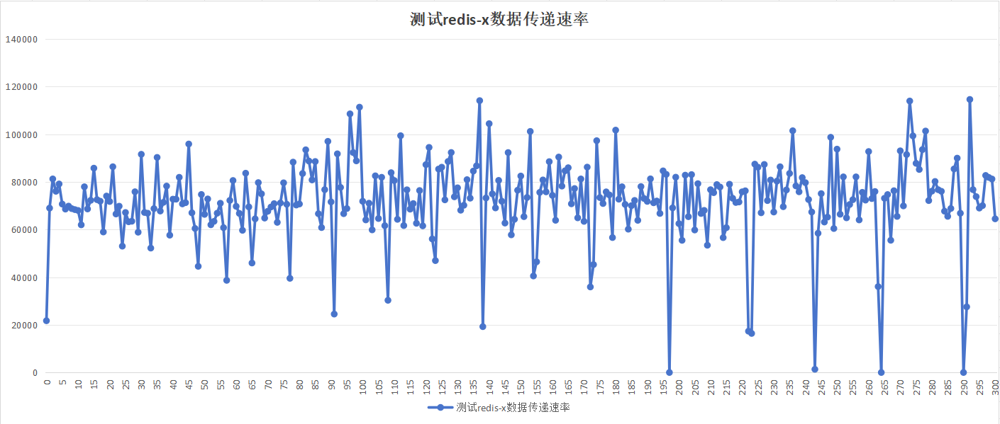

10w tps下redis-x控制台输出日志

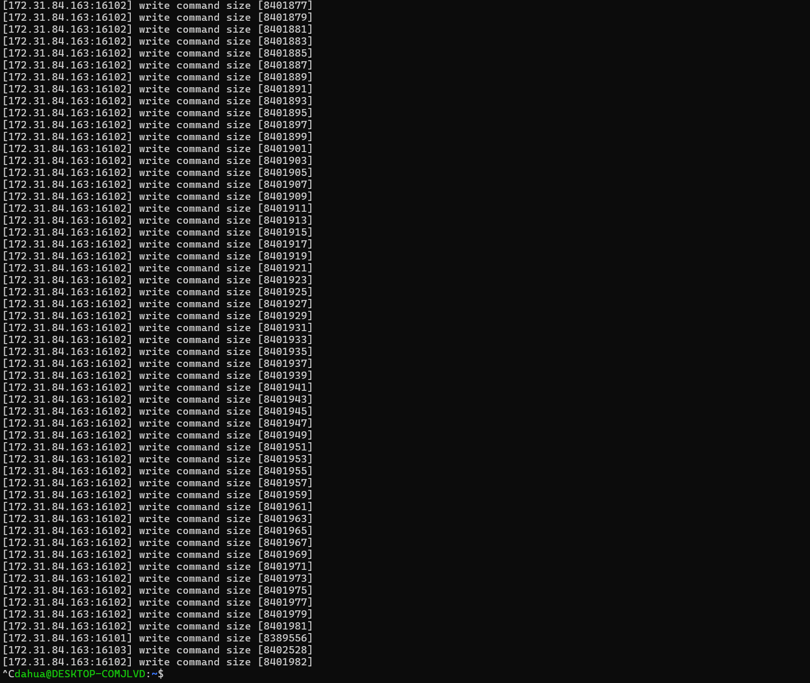

5w tps下redis-x压测表现


5w tps下redis-x控制台输出日志

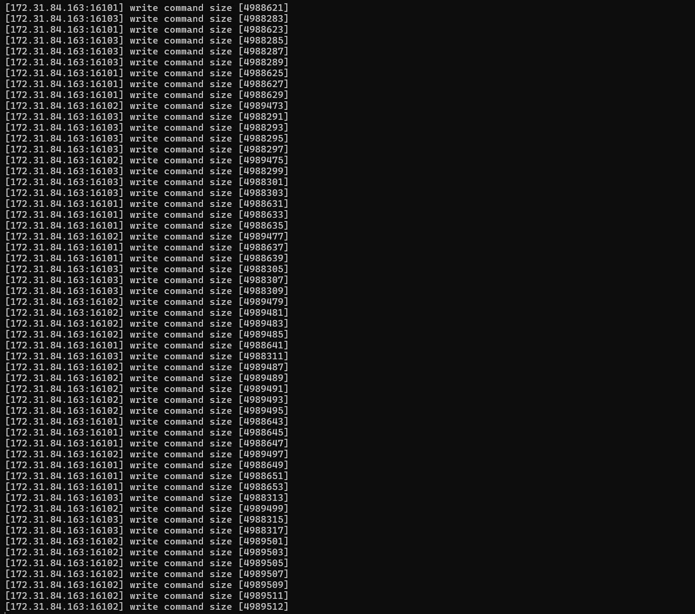

### 名词解释

From：数据来源的Redis集群对应Redis-x中的节点。

To：需要被同步数据的Redis集群对应Redis-x中的节点。

### 启动环境

环境需求为Jdk1.8+，启动指令为java -jar redis-x.jar。

### 建设思路


### 准确性测试

在默认模式下（笔记本中测试，因为反复测试切换场景，所以数据传递落后于发布数量）：

Redis：2.8.0（双端单机，此版本Redis不支持集群。Redis-x组件2节点）


Redis：3.0.3（双端集群，3主3从。Redis-x组件2节点）


Redis：4.0.11（双端集群，3主3从。Redis-x组件2节点）


Redis：5.0.0（双端集群，3主3从。Redis-x组件2节点）


Redis：6.0.9（双端集群，3主3从。Redis-x组件2节点）


Redis：7.2.4（双端集群，3主3从。Redis-x组件2节点）


### 模式支持

#### Reids双端模式：

源：集群 - 入：集群

源：单机/哨兵 - 入：集群

源：集群 - 入：单机/哨兵

源：单机/哨兵 - 入：单机/哨兵

#### Reids-x模式

##### 默认模式

默认采用一秒一次的频率提交偏移量，100条/100毫秒频率提交数据至To端集群，此模式吞吐量较高，和强一致模式互斥。

##### 强一致模式

强一致模式每条数据写入To集群后都会强制同步一次偏移量，此模式稳定性较高，和默认模式互斥。

##### 强制全量同步数据模式

强制全量同步数据模式为每次启动都会强制全量同步主/从所有数据信息，大数据量下初始会存在延迟，但是可以保证数据幂等性，此模式不与其他模式互斥。

### 配置介绍

项目启动如无指定配置文件时会自动扫描resources目录下的redisx.yml，如果需要指定配置文件需要在启动指令后添加配置文件地址。如：

```shell
java -jar redisx.jar redisx.yml
```

配置文件中参数：

```yaml
redisx:         
  from:
  	redis:
      version: 7.2.4          #From端redis版本，From和To可以不一致（必要参数）
    password: 1a.2b*          #From端redis密码
    isCluster: true           #From端redis是否为集群
    address:
      - 127.0.0.1:16001       #From端redis集群地址（必要参数）
      - 127.0.0.1:16002
      - 127.0.0.1:16003
  to:
    password: 2b*1a.          #To端redis密码
    isCluster: true           #To端redis是否为集群
    address:
      - 127.0.0.2:16101       #To端redis集群地址（必要参数）
      - 127.0.0.2:16102
      - 127.0.0.2:16103
    flushSize: 30             #设置to端写入集群的条数频率
  console:
    enable: false             #是否启用控制台，控制台主要用于双向查询数据
    port: 9999                #控制台发布端口
    timeout: 5000             #控制台查询时间
  immediate:                  
    enable: false             #是否开启强一致模式
    resendTimes: 3            #强一致模式下写入失败重试次数
  alwaysFullSync: false       #全局是否强制全量同步数据模式
  switchFlag: REDIS-X-AUTHOR:DAHUA&CHANGDONGLIANG&ZHANGHUIHAO&ZHANGSHUHAN      #redis-x主从切换标志，在纵向扩展时需要配置
  syncRdb: false              #是否同步rdb文件，否：只进行增量同步
```

主从模式下From端希望配置从节点，主节点也可以，但是不要同时连接，会造成数据多次写入。To端只能配置主节点，否则会造成数据丢失。哨兵模式下需要连接真实主节点。

### 高可用

Redis-x组件天然支持多节点启动，多节点间会自动选举一个主节点，当主节点宕机10秒后，从节点们会自动选举一个新的主节点。


#### 纵向扩展

纵向扩展场景一般存在于一端为集群模式时，Redis-x组件可自动剔除非配置节点hash槽数据，多节点可通过多组并行模式进行纵向扩展。

### 建设中问题回顾

#### Rdb流解析时服务断连问题

表象：此问题在建设过程自测中不存在，大批量测试时发现Reids-x组件在同步完Rdb流数据后就会和主/从节点断开连接。

排查：通过分析日志发现系统处理并无异常，通过抓包工具发现大批量测试时系统在处理Rdb流文件时会导致Ack线程没有及时执行，经过分析发现是处理中阻塞主线程导致，调整成异步处理，阻塞等待同时发送心跳。

#### ShutdownHook函数内容部分执行

表象：我们注册了ShutdownHook函数用于处理缓冲区数据不丢失，实际过程中发现此函数只执行部分逻辑，缓冲区数据丢失，由于此函数无法断点调试，我们加了很多日志，测试过程中发现日志打印不全也没有规律。

排查：此问题为两部分：1.逻辑只执行部分导致数据丢失；2.日志输出不全。经过排查发现关闭函数为异步，需要同步阻塞或者添加监听器来等待关闭事件，但是由于程序中只是提交了关闭事件就导致无法平滑关闭程序就中止了，此问题调整成同步等待关闭事件，经过测试数据无丢失问题了。日志打印不全经过分析是因为多个ShutdownHook间是并发执行且无顺序，所以log4j2注册的ShutdownHook事件和我们注册的会冲突，导致有些日志无法记录，此问题是因为恰巧我在调试时使用了sysout输出方式发现sysout可以正常打印而发现，解决方案是关闭log4j2注册的ShutdownHook事件，在我们的ShutdownHook事件最后手动调用log4j2的ShutdownHook事件，经过测试日志可以正常打印。

#### 高可用产生的脑裂问题

表象：双节点同时为主节点，offset发生错乱。

排查：此问题无法完全规避，因为设置10秒等待抢占、1秒写入机制，所以程序恰巧同时执行到此段逻辑都认为自己应该升主，所以导致脑裂。不过此问题可以尽可能规避发生概率，由于java语言对于秒、毫秒、微妙、纳秒等时间精度处理不同，所以将之前的秒单位换成微妙单位（纳秒太夸张），这样虽然设置的时间没变，但是在高精度下尽量规避程序错误认知升主问题，同时加上lua表达式先查再写，尽最大可能规避脑裂问题，经过测试无法复现脑裂问题，但是理论上仍存在脑裂可能。

注：本问题发生在节点间同时启动时，如果我们让节点错峰启动，那么就可完全规避此问题，但是程序是严谨的，我们仍在思考解决方案希望在任何情况下都可以规避此问题。

#### Netty channel isWritable引发的惨案

表象：由于双录项目组试用时发现存在空格回车符同步失败的问题（通过redis client无法写入空格等，我们没有针对空格处理），所以对数据解析过程进行了优化。改造后发现指令同步时会发生同步速率触底，在减少单次写入指令数量后，速率回升，增加单次写入数量，速率降低。

排查：程序中兜底设置了每100毫秒刷新缓冲区一次，但是刷新缓冲区间隔远超100毫秒。通过使用arthas及断点排查等方式，未发现写入及刷新过程耗时。继续排查外层方法，最终发现是channel.isWritable的条件判断导致的，当写入大量数据时，会导isWritable长期处于false阶段，所以无法进行下一次刷新缓冲区操作。

注：Netty对于写入缓冲区设置了高水位（默认64k）和低水位（默认32k），在缓冲区写入数据大小达到了高水位，isWritable就会返回false，这时需要执行刷新缓冲区方法将缓冲区数据大小发送出去降低到低水位后，isWritable才会返回true，由于程序中使用了isWritable判断条件，就导致了程序在发送数据时无法进行缓冲区写入，所以导致tps触底。在减小单词写入指令数量后，可以让缓冲区更快进行刷新，同时水位下降的更快，就可以升高tps，符合表象。